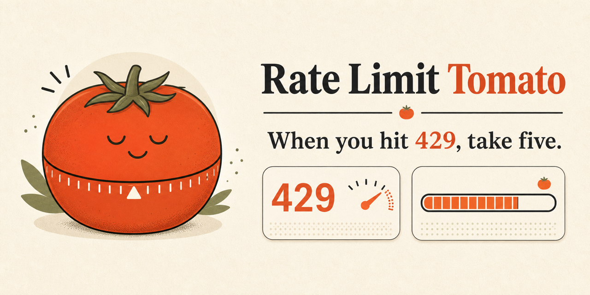
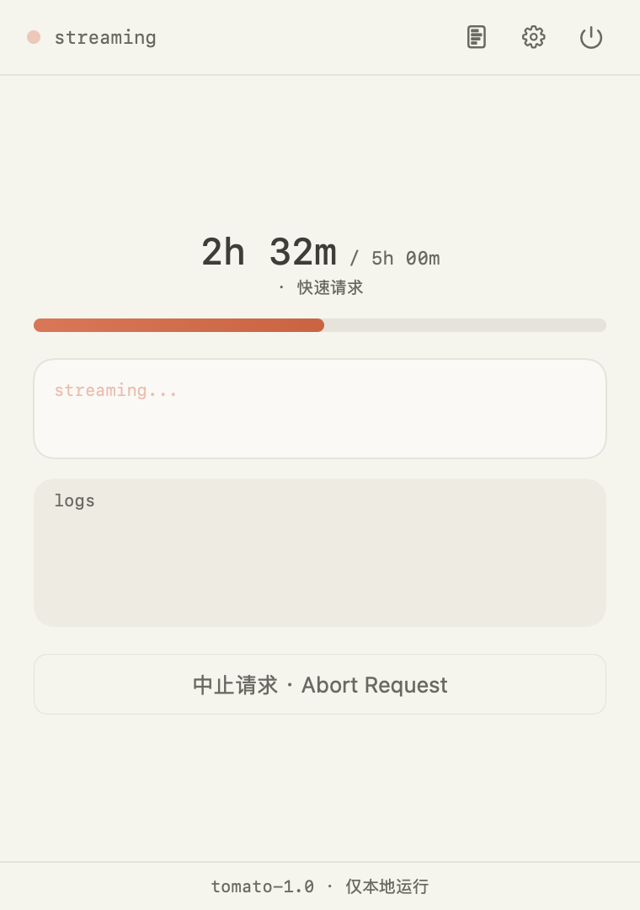
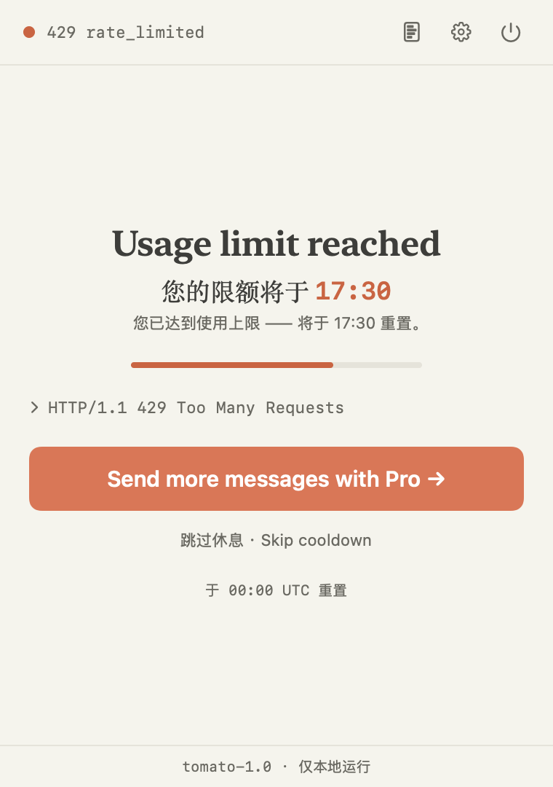
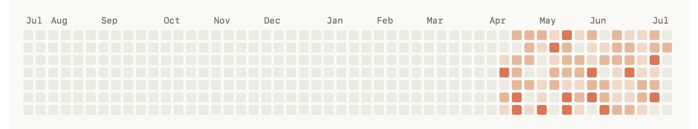

# Rate Limit Tomato 🍅



> **When you hit 429, take five. · 让 429 替你喊停。**

Rate Limit Tomato 是一款本地优先的 macOS 菜单栏番茄钟，把虚构的 AI 限流体感变成 25 分钟专注与 5 分钟休息。每次 “fast request” 都是一个番茄；收到 `429`，就该离开屏幕喘口气。

Rate Limit Tomato is a local-first macOS menu-bar Pomodoro that turns fictional AI-style rate limits into a healthy rhythm of focus and rest. One “fast request” starts a focus session; `429` means it is time to take five.

> [!IMPORTANT]
> **源码优先 · Source first.** 当前没有面向公众的、经过 Apple 公证并可直接通过 Gatekeeper 安装的稳定二进制。先前的内部工程包已签名但未公证，现已撤下公开分发；请先按下方步骤从源码构建。
>
> There is currently no public stable binary that is Apple-notarized and ready for normal Gatekeeper installation. A previous private engineering artifact was signed but unnotarized and has been removed from public distribution. Build from source for now.

## 看起来像限流，用起来是番茄钟

| 专注请求 · Focus request | 429 休息 · Rate-limited break |
|---|---|
|  |  |



## 功能 · Highlights

- **一条请求，一个番茄 · One request, one focus session**：默认 25 分钟专注、5 分钟冷却，完整状态机处理开始、完成、中止、限流与恢复。
- **三套中立主题 · Three neutral themes**：温柔纸面、深色赛博和终端绿字，共用同一套业务逻辑。
- **本地热力图 · Local activity heatmap**：年度活动网格与单日小时分布均由本机专注记录生成。
- **macOS 系统接线 · macOS integrations**：完整 `.app` 形态支持系统通知、`⌘⌥F` 全局快捷键、可选开机自启和六条 `rlt://` 命令。
- **双语界面 · Bilingual interface**：中文主文案与英文协议风格副文案并列。
- **可测试核心 · Testable core**：状态机、持久化、时间映射、假数据和聚合逻辑集中在平台中立的 `TomatoCore`。

## 隐私与戏仿红线 · Privacy and parody promises

- 应用运行时代码不发起网络请求，无遥测、无账号、无云同步。
- 用户数据保存在 `~/Library/Application Support/RateLimitTomato/`。
- 所有额度、套餐、价格、响应头和用量数字均为虚构。
- 不接入真实支付，不收集支付信息，不打开任何购买或订阅 URL。
- 不使用真实厂商名称、Logo 或品牌资产作为产品卖点；本项目与任何 AI 厂商均无隶属、合作或背书关系。
- 首次使用前显示戏仿免责确认；升级/定价弹窗永久显示免责小字。

- The app contains no runtime network-request code, telemetry, account, or cloud sync.
- User data stays under `~/Library/Application Support/RateLimitTomato/`.
- Every quota, plan, price, response header, and usage number is fictional.
- No real payment is processed, no payment data is collected, and no purchase URL is opened.
- The project is not affiliated with or endorsed by any AI vendor.

These are implementation guarantees verified in source and release checks; they are not claims that macOS App Sandbox enforces the behavior.

## 从源码运行 · Build from source

要求 macOS 14+，以及支持 Swift tools 5.9 的 Xcode/Swift 工具链。首次解析 SwiftPM 依赖需要联网；构建后的应用运行时不需要网络。

Requires macOS 14+ and an Xcode/Swift toolchain supporting Swift tools 5.9. Resolving SwiftPM dependencies requires network access during the build; the resulting app does not require network access at runtime.

```bash
git clone https://github.com/rtwsvj/rate-limit-tomato.git
cd rate-limit-tomato
swift build
swift test
bash scripts/verify.sh
swift run RateLimitTomato
```

裸 `swift run` 适合开发，但没有完整 `.app` bundle，通知与 URL Scheme 会安全降级为 no-op。需要本机 `.app` 形态时可构建 ad-hoc 包：

Bare `swift run` is intended for development. Notifications and the URL scheme safely degrade to no-op without a full `.app` bundle. To build a local ad-hoc app:

```bash
bash scripts/make-app.sh \
  --configuration release \
  --arch current \
  --sign adhoc
```

不要把 ad-hoc 或未公证构建重新分发成“官方稳定版”。公开二进制还必须通过公证、stapling、Gatekeeper、干净系统安装和归档完整性验证。

Do not redistribute an ad-hoc or unnotarized build as an official stable release. A public binary must additionally pass notarization, stapling, Gatekeeper, clean-machine installation, and archive-integrity checks.

## URL Scheme

以下命令仅在打包后的 `.app` 中可用：

| 命令 | 行为 |
|---|---|
| `rlt://startstop` | 开始专注或中止当前专注 |
| `rlt://send` | 仅发起一次 fast request |
| `rlt://abort` | 仅中止当前专注 |
| `rlt://skip` | 跳过当前冷却 |
| `rlt://usage` | 打开本地用量看板 |
| `rlt://settings` | 打开设置 |

## 项目结构 · Architecture

```text
Sources/
├── TomatoCore/             状态机、数据模型、JSON 持久化、i18n、聚合与假数据
├── RateLimitTomatoUI/      SwiftUI 视图、主题、服务与 AppViewModel 接线
└── RateLimitTomato/        @main、MenuBarExtra 与窗口装配

Tests/
├── TomatoCoreTests/        核心行为与故障回归
├── RateLimitTomatoUITests/ UI 接线与系统服务边界
└── RLTSnapshotTests/       ImageRenderer 视觉快照
```

产品规范、当前实现状态和公开发布边界分别见：

- [产品规格](docs/SPEC.md)
- [实现状态](docs/STATUS.md)
- [外部审计交接](docs/AUDIT_HANDOFF.md)
- [开源发布说明](docs/OPEN_SOURCE_LAUNCH.md)
- [发布检查清单](docs/RELEASE-CHECKLIST.md)
- [贡献指南](CONTRIBUTING.md)
- [安全策略](SECURITY.md)

## License

项目源码采用 [MIT License](LICENSE)。直接依赖的版权与许可证声明见 [THIRD_PARTY_NOTICES.md](THIRD_PARTY_NOTICES.md)。

The project source is available under the [MIT License](LICENSE). Third-party copyright and license notices are listed in [THIRD_PARTY_NOTICES.md](THIRD_PARTY_NOTICES.md).
